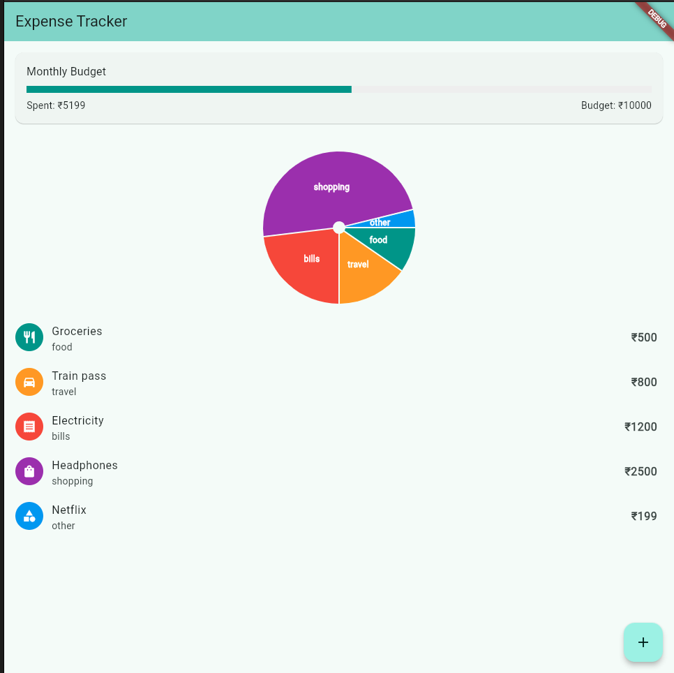

# Expense Tracker 💰

A Flutter app to track your daily expenses, built as my second portfolio project.

## What it does

- Add expenses with a title, amount, and category (Food, Travel, Bills, Shopping, Other)
- View a pie chart breaking down spending by category
- Track a monthly budget with a progress bar that turns red when you overspend
- Swipe left on any expense to delete it
- Category icons for quick visual identification

## Built with

- **Flutter** — UI framework
- **Provider** — state management
- **fl_chart** — pie chart
- **uuid** — unique IDs for each expense

## What I learned

This was my first real Flutter project. I learned how the widget tree works, the difference between StatelessWidget and StatefulWidget, and how Provider separates logic from UI. The hardest parts were implementing swipe-to-delete with Dismissible and adding category icons — both were completely new concepts for me.

## Screenshots



## How to run

```bash
git clone https://github.com/ujwaljain506-hash/Expense-Tracker.git
cd Expense-Tracker
flutter pub get
flutter run
```